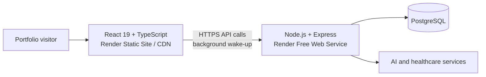

# MedAI Pro

Full-stack healthcare portfolio application with separate patient and doctor experiences, structured symptom analysis, patient record management, and AI-assisted health guidance.

> **[Open Live Demo](https://medai-pro-instant-demo.onrender.com/)** · **[View GitHub](https://github.com/DKon109/AI-chatbot)**
>
> The landing page is served as a free static site and opens immediately. Interactive login and analysis use a separate Render Free API, which can take up to 60 seconds to wake after inactivity. The page starts waking it in the background as soon as a visitor arrives.

## Product overview

MedAI Pro explores how a role-based healthcare assistant can combine conversational guidance with structured clinical workflows. Patients can record symptoms and receive safety-focused guidance, while doctors can manage fictional patient records and review supporting information from a dedicated dashboard.

All included portfolio data is fictional. This project is an educational software demonstration and does not provide medical diagnosis or replace professional medical care.

## Highlights

- Patient and doctor registration/login with JWT authentication
- Role-based protected routes and dashboards
- Structured symptom collection and severity-aware responses
- Patient record CRUD workflows for doctors
- Chat history, dietary recommendations, pharmacy search, and hospital search
- PostgreSQL persistence with parameterized queries and connection pooling
- Repeatable database migrations and deterministic portfolio seed data
- Dockerized full-stack production build for portable deployment
- Instant-loading Render Static Site with a separate Free API, automatic migrations, and health checks

## Architecture



The recruiter-facing frontend is deployed as a static site, so the first screen does not depend on a sleeping server. It immediately sends a background health request to the Free API. Interactive requests allow enough time for a normal cold start and show a clear startup message instead of a generic network error. The Docker image still contains the combined frontend and API as a portable fallback.

## Technology

| Area | Technologies |
| --- | --- |
| Frontend | React 19, TypeScript, Vite, React Router, Axios, Lucide React |
| Backend | Node.js, Express, JWT, bcrypt, Helmet, express-validator |
| Data | PostgreSQL, SQL migrations, UUID primary keys |
| AI workflow | Deterministic symptom analysis, multi-agent service design, optional OpenAI integration |
| Delivery | Docker, Render/Railway config-as-code, health checks |

## Demo accounts

Running `npm run db:seed` creates two fictional, idempotent accounts:

| Role | Email | Password |
| --- | --- | --- |
| Patient | `demo.patient@example.com` | `PortfolioDemo!2026` |
| Doctor | `demo.doctor@example.com` | `PortfolioDemo!2026` |

Set `DEMO_PASSWORD` before seeding to use a different demo password.

## Local setup

Requirements:

- Node.js 22+
- PostgreSQL 12+

```bash
git clone https://github.com/DKon109/AI-chatbot.git
cd AI-chatbot/medical-ai-enhanced

cp backend/env.example backend/.env
# Add your local PostgreSQL password and a random JWT_SECRET to backend/.env

./setup-database.sh

cd backend && npm start
# In another terminal:
cd frontend && npm install && npm start
```

The frontend runs at `http://localhost:3000`; the API defaults to `http://localhost:5001`.

### Database commands

From `medical-ai-enhanced/backend`:

```bash
npm run db:create   # create the local database when it does not exist
npm run db:migrate  # apply all schemas safely
npm run db:seed     # add deterministic fictional portfolio data
npm run db:init     # run all three steps
```

Hosted PostgreSQL providers should set `DATABASE_URL`. Local development can use the individual `DB_HOST`, `DB_PORT`, `DB_NAME`, `DB_USER`, and `DB_PASSWORD` variables shown in [`env.example`](medical-ai-enhanced/backend/env.example).

## Railway deployment

The repository includes [`Dockerfile`](Dockerfile) and [`railway.json`](railway.json). Railway builds both applications, runs migrations and demo seeding before deployment, then checks `/api/status` before marking the release healthy.

1. Create a Railway project from this GitHub repository.
2. Add a PostgreSQL service.
3. Reference the PostgreSQL service's `DATABASE_URL` from the application service.
4. Set `JWT_SECRET` to a random value of at least 32 characters.
5. Set `DB_SSL=true`, `NODE_ENV=production`, and optionally `DEMO_PASSWORD`.
6. Generate a public domain for the application service.

Railway pricing and free allowances can change; review the current plan before deployment. The Docker image is portable to other container hosts, and the database only requires a standard PostgreSQL connection URL.

## Free portfolio deployment (Render + Supabase)

The repository includes [`render.yaml`](render.yaml), which creates two services while keeping the instance configuration free:

- `medai-pro-instant-demo`: static React site served from Render's CDN; it does not have a server process that spins down.
- `medai-pro-portfolio`: Free Express API connected to the Supabase Free PostgreSQL database; it can spin down after inactivity.

1. Create a Supabase Free project and keep its generated database password private.
2. In Render, create a new Blueprint from this repository.
3. Enter only the Supabase database password in Render's `DB_PASSWORD` prompt. Do not commit it or post it in an issue/chat.
4. Confirm that the service plan is **Free**, then deploy.

The API container starts accepting health requests before running its idempotent migrations and fictional demo seed in the background. Render generates `JWT_SECRET` automatically. No OpenAI or Google Maps key is required for the core portfolio demo.

The static landing page remains immediately available even when the API is asleep. The UI starts waking the API during the visitor's first read and clearly explains that the first interactive action can take up to 60 seconds. Free-tier terms and usage allowances can change; confirm the provider dashboards still show **Free / $0** before deployment.

## Security decisions

- `.env` files, dependencies, generated model files, logs, and runtime feedback are excluded from Git.
- Passwords are hashed with bcrypt and never returned by API responses.
- SQL calls use parameterized queries.
- Authentication endpoints validate input and protected endpoints verify JWTs.
- Helmet, CORS allowlisting, and rate limiting are enabled.
- Secrets are supplied through environment variables rather than source control.

If a secret was committed in an earlier revision, it must be rotated even after the file is removed from the latest revision.

## Repository structure

```text
.
├── Dockerfile
├── render.yaml
├── railway.json
└── medical-ai-enhanced
    ├── backend
    │   ├── agents
    │   ├── controllers
    │   ├── database
    │   ├── routes
    │   ├── scripts
    │   └── services
    └── frontend
        ├── public
        └── src
```

## Current limitations

- AI provider features require a separately configured API key; deterministic local analysis remains available without one.
- Location-based pharmacy and hospital functionality depends on external map/search services.
- The application is a portfolio prototype and has not undergone clinical validation or production compliance certification.

## API health check

```bash
curl http://localhost:5001/api/status
```

A healthy service returns a JSON response with `status: "success"`.
